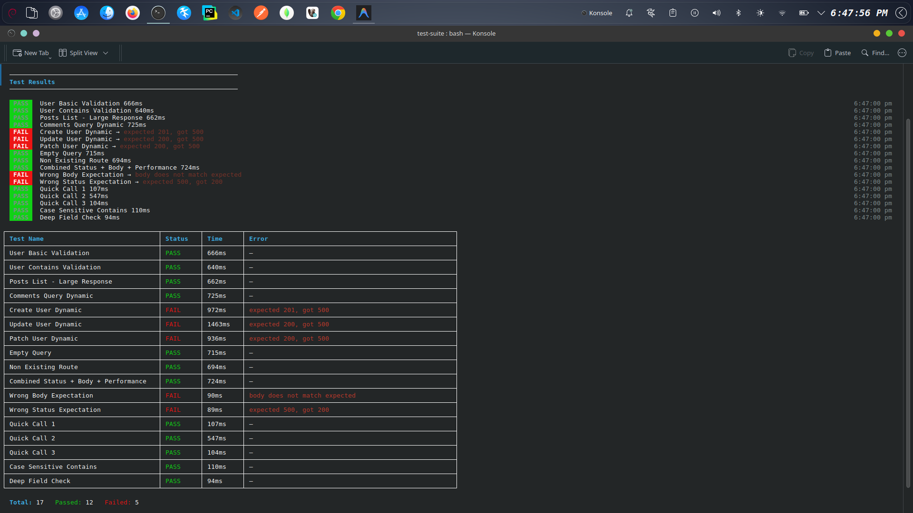

# API Testing Suite

A CLI-based API testing tool built with TypeScript in a TurboRepo monorepo.

Define API tests using YAML, execute them in parallel with configurable concurrency, and validate responses using deep matching and schema validation. Designed for performance, reliability, and clean architecture.

---

## Features

- YAML-based test definitions for simple and readable test cases  
- Parallel test execution with configurable concurrency control  
- Retry mechanism for transient failures (network/timeouts)  
- Environment variable templating using `${VAR}` syntax  
- Deep partial response matching (nested object validation)  
- Timeout handling using AbortSignal to prevent hanging requests  
- Schema validation using Zod for strict input validation  
- Support for headers, query parameters, and request bodies  
- Deterministic result ordering even under parallel execution  
- Structured CLI logging with categorized output (pass/fail/info/warn) and timestamps
- JSON report generation with summary, metrics, and per-test results  
- Modular architecture separating CLI and core engine  

---

## Architecture

```

apps/
└── cli/        # CLI interface

packages/
└── core/       # Test engine (execution, validation, concurrency)

````

---

## Installation

```bash
git clone https://github.com/pyd-07/api-test-suite.git
cd api-testing-suite
npm install
npm run build
````

(Optional: link CLI globally)

```bash
npm link
```

---

## Usage

```bash
suite run test.yml
```

With concurrency control:

```bash
suite run test.yml --concurrency 5
```

---

## Environment Variables

You can use environment variables inside your YAML using `${VAR}` syntax.

### Example `.env`

```env
BASE_URL=https://jsonplaceholder.typicode.com
USER_ID=1
NAME=Piyush
```

### Example YAML

```yaml
version: 1

baseUrl: ${BASE_URL}

tests:
  - name: Get User
    request:
      method: GET
      url: /users/${USER_ID}
    expect:
      status: 200

  - name: Create User
    request:
      method: POST
      url: /users
      body:
        name: ${NAME}
    expect:
      status: 201
```

### Notes

* Variables are resolved before schema validation
* Missing variables will throw an explicit error
* Works across nested objects and arrays

---

## Example Test File

```yaml
version: 1

baseUrl: https://jsonplaceholder.typicode.com

tests:
  - name: Get User
    request:
      method: GET
      url: /users/1
    expect:
      status: 200
      responseTime: 500
      body:
        equals:
          id: 1
          name: "Leanne Graham"
```

---

## Assertions

### Status Code

```yaml
expect:
  status: 200
```

---

### Response Time

```yaml
expect:
  responseTime: 500
```

---

### Deep Partial Matching

```yaml
expect:
  body:
    equals:
      id: 1
      address:
        city: "Gwenborough"
```

Matches nested fields and ignores extra fields in the response.

---

### Contains (string match)

```yaml
expect:
  body:
    contains: "Leanne"
```

---

## Request Configuration

```yaml
request:
  method: POST
  url: /users
  headers:
    Content-Type: application/json
  query:
    userId: 1
  body:
    name: "Piyush"
```

---

## Timeout Handling

```yaml
expect:
  timeout: 2000
```

* Aborts the request if it exceeds the defined limit
* Timeout errors are treated as retryable failures (if retries are configured)

---

## Retry Mechanism

Tests can be configured to retry automatically on transient failures such as network errors or timeouts.

```yaml
tests:
  - name: Retry Example
    request:
      method: GET
      url: /users/1
    retryDelay: 200
    retries: 2
    expect:
      status: 200
```

* `retries`: Maximum number of retry attempts (default: 2)
* `retryDelay`: Delay between retries in milliseconds (default: 200)
* Retries only on network errors and timeouts
* Final result shows total attempts and time

---

## Logging

The CLI uses structured and categorized logging for clear output.

### Log Types

- `✔ PASS` → Test succeeded  
- `ERROR [FAIL]` → Test failed with reason  
- `WARN` → Summary warnings  
- `ℹ` → Informational logs (setup, environment, workers)  

### Features

- Timestamped logs for each test execution  
- Worker/concurrency visibility  
- Environment injection visibility  
- Failure grouping at the end of execution  

Logging is handled at the orchestration layer to prevent duplicate logs during retries.


## CLI Output Preview


---

## Design Principles

* Separation of concerns (CLI vs core engine)
* Composable execution pipeline (runner, concurrency, validation)
* Deterministic output under parallel execution
* Minimal dependencies with scalable architecture

---

## Roadmap

* Array matching support
* Authentication support

---

## Tech Stack

* TypeScript
* Node.js (Fetch API)
* TurboRepo
* Zod

---

## Development Notes

This project was built with the assistance of AI tools to accelerate development and experimentation.

AI was primarily used for:
- Generating initial implementations for isolated components
- Exploring alternative approaches to logging, concurrency, and validation
- Speeding up iteration during feature development

All architectural decisions, system design, and final integrations were implemented and reviewed manually to ensure correctness, maintainability, and consistency across the codebase.

The goal of this project is not just functionality, but to demonstrate strong understanding of:
- System design (execution pipeline, retries, concurrency)
- Clean architecture (separation of CLI and core engine)
- Developer tooling and usability

---

## Contributing

Contributions, issues, and feature suggestions are welcome.

---

## License

MIT

